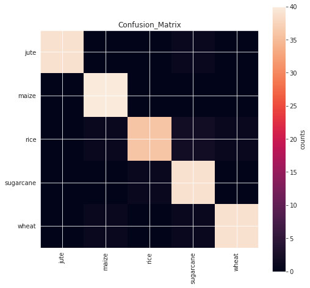

# Crop Classification with Transfer Learning VGG16

Building a Classification model using VGG16 pre-trained model using Tensorflow & Keras. 

Image classification refers to a process in computer vision that can classify an image according to its visual content.
This is a image classification based on Agriculture crop images of wheat,rice,sugarcane,jute,maize(Corn).

**About the data:** 

Dataset available at kaggle https://www.kaggle.com/aman2000jaiswal/agriculture-crop-images?select=crop_images

## Data Analysis

**Image Categories VS Number of images in each Categories:** 

## Data Preprocessing

For every Train and Test images,resize the image to have a shape of (224, 224, 3)=(image_width, image_height, number of channels): because images in the dataset come in different sizes.
So, all images should have the same shape to feed it as an input to the VGG16 neural network.

# Neural Network Architecture

This is the architecture of VGG16:

# Training the model

The total epochs applied in this model is 40, best model saved with minimum validation loss 0.2196.

# Results

In this experiment, the results of classification of crop images are: 

**Accuracy Plot:** 

**Loss Plot:** 

**Confusion Matrix:** 

**Classification Reports:** 

**Performance of the  model:**

| <!-- -->  |   Train set    |Validation set |
| --------- | -------------- | --------------|
| Accuracy  |     94.69%     |     95.83%    |

Contributes are welcome!
 Thank you!

